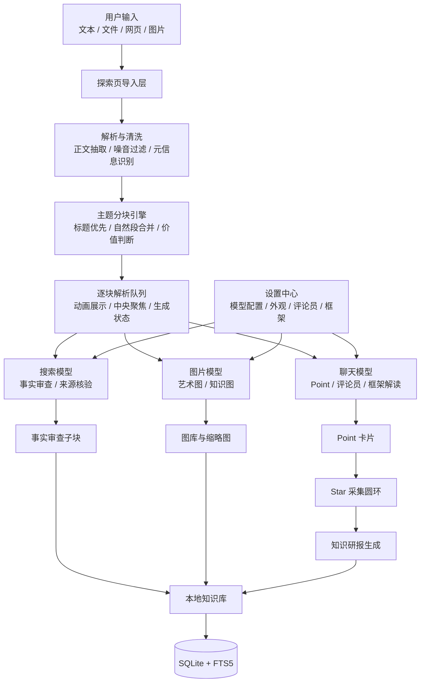

# Deep Explorer

<p align="center">
  <strong>深度探索助手 · 本地优先的 AI 阅读、审查与知识沉淀桌面应用</strong>
</p>

<p align="center">
  <em>Your point is great! Now it's mine!</em>
</p>

<p align="center">
  <a href="https://github.com/BevalZ/Thepoint/stargazers"></a>
  <a href="https://github.com/BevalZ/Thepoint/releases"></a>
  <a href="LICENSE"></a>
  
  
  
  
  
</p>

> 从文档到洞见，让每一次探索都有迹可循。

Deep Explorer 是一款完整自我开发的桌面端 AI 阅读与知识分析软件。它可以从文本、网页、文件和图片中提取信息块，逐块生成 Point，支持星标采集、事实审查、评论员解读、框架解读、知识研报和 AI 生图。

项目坚持本地优先：配置、历史、知识库、存档和 API Key 均保存在本地，不上传到项目服务器。

---

## ✨ 一眼看懂

| 🔭 探索 | ⭐ 采集 | 🧾 审查 | 🧠 沉淀 |
| --- | --- | --- | --- |
| 文本、网页、图片、文件导入 | 将重要 Point 收集成 star | 搜索模型核查事实陈述 | 本地知识库与研报沉淀 |
| 主题分块、逐块动画解析 | 圆环来源占比与清空机制 | 保存来源链接与解析块原文 | 子块、元信息、存档可追溯 |

---

## 💡 为什么做它

传统阅读工具擅长保存材料，但不擅长把材料变成可追问、可审查、可复用的知识结构。Deep Explorer 的目标是把一次阅读拆成连续的探索过程：

1. 📥 导入材料。
2. 🧩 按主题切成信息块。
3. ✨ 逐块生成可验证的 Point。
4. 🔎 对事实陈述做搜索核查。
5. ⭐ 收集 star，生成知识研报。
6. 📚 把结果沉淀到本地知识库。

---

## 🧭 核心能力

| 模块 | 能力 |
| --- | --- |
| 🔭 探索页 | 支持粘贴文本、拖拽文件、网页抓取和图片导入，按主题拆分信息块并逐块动画解析 |
| ✨ Point 生成 | 自动判断信息块价值，短文本不主动生成，允许手动触发 AI 解读 |
| ⭐ Star 采集 | 将重要观点采集到圆环，支持来源占比、清空、生成知识研报 |
| 🔎 事实审查 | 对事实陈述调用搜索模型，结果保存为独立子块，保留解析块原文与来源链接 |
| 🎭 评论员系统 | 由 LLM 根据文本内容选择合适评论员，再一次调用完成评论 |
| 🧠 框架解读 | 支持内置框架和用户自定义框架，用结构化方式重读文本 |
| 🖼️ AI 生图 | 支持艺术性生图与知识性生图，图片模型可单独配置 |
| 📚 知识库 | 支持树状子块、原文查看、元信息保留、存档、重新激活和搜索 |
| 🌌 动效体验 | 启动动画、星空背景、星标飞行动画、卡片堆叠、光效提示和桌面窗口控制 |

---

## 🏗️ 技术架构



---

## ⚙️ 技术栈

| 层级 | 选型 |
| --- | --- |
| 🖥️ 桌面框架 | Tauri 2 + Rust |
| ⚛️ 前端 | React 18 + Vite + TailwindCSS |
| 🎞️ UI 与动效 | shadcn/ui 风格组件 + Framer Motion |
| 🦀 后端逻辑 | Rust Tauri commands |
| 🗃️ 数据库 | SQLite + rusqlite + FTS5 |
| 📄 文档解析 | lopdf, docx-rs, pptx-rs 等解析链路 |
| 🌐 网页解析 | HTML 源码正文抽取、噪音清洗、LLM 辅助裁剪 |
| 📊 图表 | ECharts |
| 🤖 AI 接口 | OpenAI-compatible HTTP API / Ollama 兼容接口 |
| 🚀 打包 | GitHub Actions 多平台构建 |

---

## 🚀 快速开始

### 🧰 环境要求

- Node.js 20+
- Rust stable
- Tauri 2 桌面依赖

Linux 需要额外安装 WebKit / GTK / AppIndicator / librsvg 等 Tauri 依赖。

### 📦 安装依赖

```bash
cd frontend
npm ci
```

### 🧪 开发运行

```bash
cargo tauri dev
```

### 🧱 前端构建

```bash
cd frontend
npm run build
```

### 📦 桌面打包

```bash
cargo tauri build
```

---

## 🤖 模型配置

首次启动后请进入设置：

1. 💬 配置聊天模型，用于 Point、评论员、框架解读和研报生成。
2. 🔎 配置搜索模型，用于事实审查。
3. 🖼️ 配置图片模型，用于艺术性生图和知识性生图。
4. 🎛️ 按需添加评论员、框架和外观主题。

所有 API Key 均保存在本地。

---

## 📥 发布与下载

Release 由 GitHub Actions 自动构建，目标平台包括：

- 🪟 Windows: `.msi` / `.exe`
- 🍎 macOS: Apple Silicon / Intel
- 🐧 Linux: `.deb` / `.AppImage` / `.rpm`

推送 tag 即可触发构建：

```bash
git tag v0.1.0
git push origin v0.1.0
```

也可以在 GitHub Actions 页面手动运行 `Build and Release` workflow。

---

## 🌟 Star History

<a href="https://star-history.com/#BevalZ/Thepoint&Date">
  <picture>
    <source media="(prefers-color-scheme: dark)" srcset="https://api.star-history.com/svg?repos=BevalZ/Thepoint&type=Date&theme=dark" />
    <source media="(prefers-color-scheme: light)" srcset="https://api.star-history.com/svg?repos=BevalZ/Thepoint&type=Date" />
    
  </picture>
</a>

---

## 🗂️ 项目结构

```text
frontend/      React 前端与交互动画
src-tauri/     Tauri / Rust 后端、权限和打包配置
docs/          产品、架构、接口和开发文档
Skills/        蒸馏人格 Skill 原始资料
```

## 📖 文档

- 📌 [产品说明](docs/product-spec.md)
- 🏗️ [架构设计](docs/architecture.md)
- 🗃️ [数据库结构](docs/database-schema.md)
- 🔌 [接口说明](docs/api-spec.md)
- 🧰 [开发环境](docs/dev-setup.md)
- 🤝 [贡献说明](docs/contributing.md)

---

## 🙏 鸣谢

感谢所有已经支持、测试和反馈这个项目的人。

感谢 [Unity2 中转站](https://unity2.ai/) 的资助支持。

<p>
  <a href="https://linux.do">
    
  </a>
  感谢 <a href="https://linux.do">linux.do</a> 社区的讨论、反馈与支持。
</p>

特别感谢 linux.do 几位佬提供 token 支持：@Member、@picpi、@Rawchat。

感谢山姆·奥特曼的慷慨。

---

## 📜 License

Deep Explorer 使用 **MIT License + Commons Clause**。

你可以自由地学习、使用、修改和二次开发本项目代码，但不得在未获得授权的情况下销售本软件、托管商业服务、出售修改版本，或将本项目作为商业产品的一部分进行商业化。

完整条款见 [LICENSE](LICENSE)。
